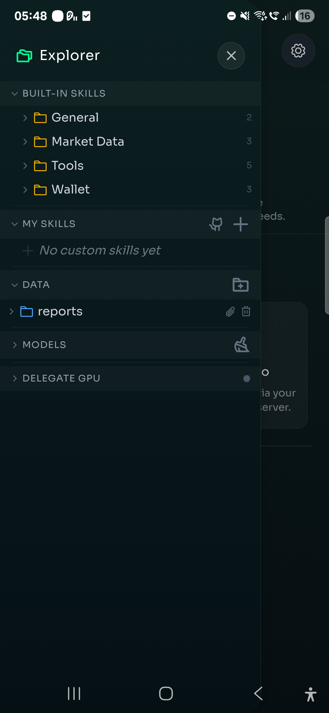
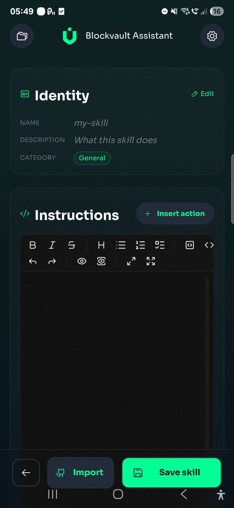
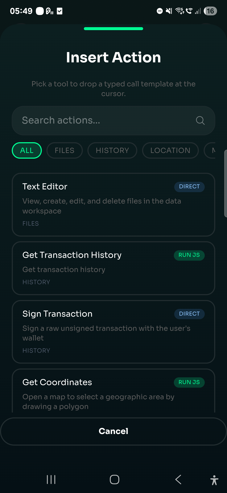
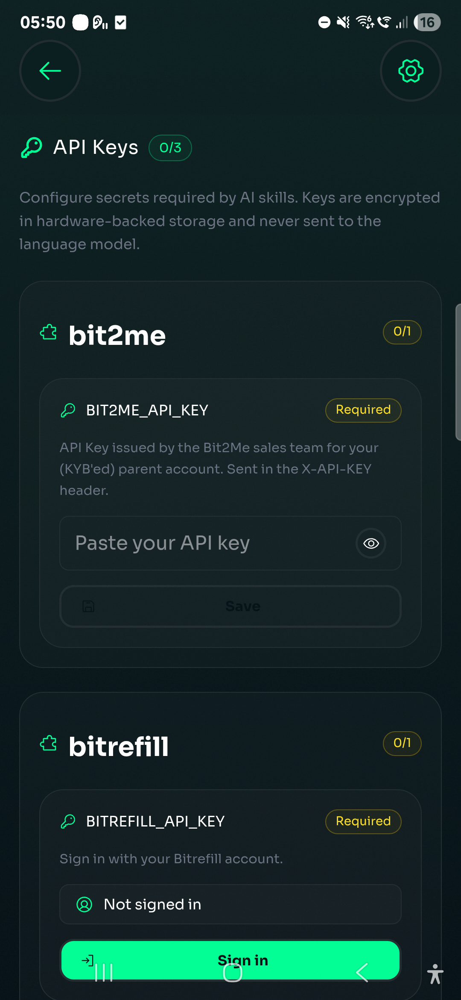
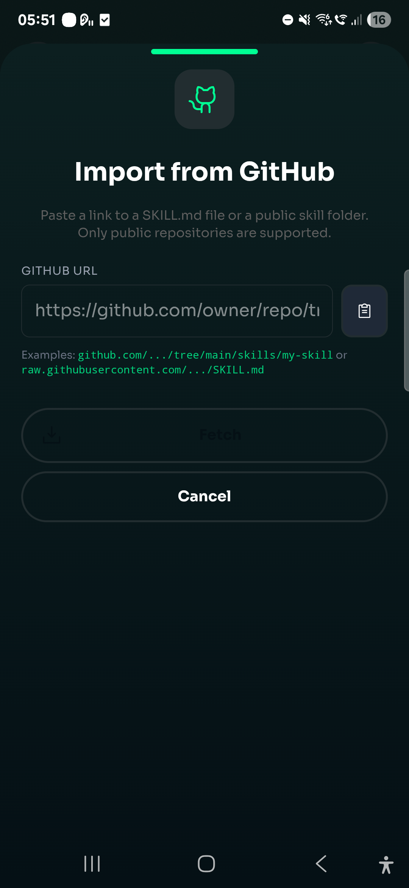

# BlockVault Skills — User Guide

This guide explains how to use, create, and configure AI Skills in BlockVault.

---

## Table of Contents

1. [What are Skills?](#what-are-skills)
2. [Using Skills](#using-skills)
3. [Creating a New Skill](#creating-a-new-skill)
4. [Using Tools in Skills](#using-tools-in-skills)
5. [Configuring Secrets & Authentication](#configuring-secrets--authentication)
6. [Importing Skills from GitHub](#importing-skills-from-github)
7. [Managing Skills](#managing-skills)
8. [Inference Modes](#inference-modes)
9. [Reference](#reference)

---

## What are Skills?

Skills are markdown files (`SKILL.md`) that teach the BlockVault AI agent how to perform specific multi-step tasks. Each skill orchestrates one or more **tools** to accomplish a goal — portfolio analysis, market scanning, memory management, etc.

Skills are loaded automatically at app startup and appear in the AI chat as capabilities the agent can invoke when you ask a relevant question.

---

## Using Skills

Simply ask the AI agent a question related to a skill's domain. The agent automatically selects the appropriate skill based on your prompt.

<p align="center">
  
</p>

**Examples:**

| Your message | Skill triggered |
|---|---|
| "Analyze my portfolio" | `portfolio-analyst` |
| "What's trending in crypto?" | `alpha-detector` |
| "Remember that I prefer BTC" | `memory` |
| "Show me stock market analysis for AAPL" | `stock-market-analyst` |
| "What's happening in Madrid crypto scene?" | `city-analyst` |

You can also enable/disable skills from **Settings → AI → Skills**. Disabled skills won't be offered to the agent.

---

## Creating a New Skill

You can create skills in two ways: using the **in-app editor** (recommended for most users) or by **writing the file manually** (for developers).

---

### Option A: Using the In-App Skill Editor

The built-in markdown editor provides a guided experience for creating skills without leaving the app.

#### Step 1: Open the editor

Navigate to **Settings → AI → Skills → Create New** (or tap the `+` button in the skills list). This opens the Skill Editor view at `/ai/skills/new`.

<p align="center">
  
</p>

#### Step 2: Set identity

Tap the **identity card** at the top to open the Identity Modal where you configure:

- **Name** — Unique identifier in `kebab-case` (e.g. `my-market-scanner`)
- **Description** — What the skill does. The agent uses this text to decide when to trigger the skill.
- **Category** — Select one: General, Wallet, Market Data, Tools, or History.

#### Step 3: Write instructions

The main area is a **full markdown editor** (powered by md-editor-v3 with CodeMirror) with:

- Dark theme optimized for mobile
- Toolbar: bold, italic, lists, code blocks, links, preview toggle, fullscreen
- Dynamic height that adjusts when the on-screen keyboard appears

Write your step-by-step instructions here. Each step should reference a tool by its exact name.

#### Step 4: Insert tool actions

Instead of memorizing tool names, tap **"Insert action"** below the editor. This opens a searchable modal showing all available tools with their descriptions and parameter schemas. Pick one and a pre-formatted markdown snippet is inserted at your cursor position:

<p align="center">
  
</p>

```markdown
### Step N: [Action description]

Call `run_js` with:
- **function**: "tool_name"
- **data**: JSON string with:
  - **param1**: Type, Required/Optional. Description.
```

#### Step 5: Configure secrets (optional)

If your skill needs API keys, scroll to the **Secrets** section:

1. Tap **"Add Secret"**
2. Fill in the **key** (auto-uppercased, e.g. `MY_API_KEY`)
3. Add a **description** explaining where to get it
4. Toggle **optional** if the skill can work without it
5. Expand **OAuth** if the service uses OAuth 2.0 (issuer, scope, client-id)
6. Tap **Save** on the secret row to persist it to secure storage

#### Step 6: Save

Tap the **Save** button in the bottom action bar. The editor:

1. Validates name and description are present
2. Serializes everything to a proper `SKILL.md` with YAML frontmatter
3. Writes the file to `Documents/BlockVault/skills/<name>/SKILL.md`
4. Registers the skill immediately — no restart needed

> **Tip:** If you navigate away with unsaved changes, the editor prompts you to confirm.

#### Editing existing skills

From the skills list, tap any **user-created skill** to open it in edit mode. Built-in skills open in a **read-only preview panel** — to customize one, create a user skill with the same name to override it.

---

### Option B: Writing the File Manually (Developers)

For developers working directly in the codebase, each skill lives in its own folder:

```
src/skills/
└── my-new-skill/
    └── SKILL.md
```

Write the SKILL.md file with two parts: **YAML frontmatter** (metadata) and **Markdown body** (instructions).

```markdown
---
name: my-new-skill
description: Short description of what this skill does (shown to the agent for matching).
metadata:
  tool: get_price
  category: market
  enabled: true
---

# My New Skill

Brief summary paragraph explaining the skill's purpose.

## Instructions

Execute all steps silently. Do NOT output internal thoughts.

### Step 1: Gather data

Call `run_js` with:
- **function**: "get_price"
- **data**: JSON string with:
  - **portfolio**: Boolean, Required. Set to `true`.

### Step 2: Analyze

Process the data from Step 1 and generate insights.

### Step 3: Present results

Format a clear report for the user with key findings.
```

After creating or editing, restart `yarn dev` so Vite picks up the new file.

---

### Frontmatter fields

| Field | Required | Description |
|---|---|---|
| `name` | Yes | Unique identifier in `kebab-case` |
| `description` | Yes | What the skill does (agent uses this for matching) |
| `metadata.tool` | Yes | Primary tool(s) the skill uses. Comma-separated for multiple tools |
| `metadata.category` | Yes | One of: `general`, `wallet`, `market`, `tools`, `history` |
| `metadata.enabled` | Yes | `true` or `false` — controls visibility |
| `metadata.homepage` | No | URL to external docs or project page |
| `metadata.secrets` | No | API keys/OAuth the skill requires (see [Secrets](#configuring-secrets--authentication)) |

### Instruction rules

- **Number all steps** — sequential and explicit.
- **Reference tools by exact name** — `run_js`, `web_search`, `bash`, `text_editor`, `sign_transaction`.
- **Specify parameters precisely** — types, required/optional, example values.
- **English only** — all instructions in English.
- **No secrets in the file** — use `{{SECRET_KEY}}` placeholders for API keys.

### Rebuild (developers only)

After creating or editing a skill in `src/skills/`, restart the dev server (`yarn dev`) so Vite picks up the new file. In production builds, run `yarn build`. User-created skills via the in-app editor don't require a rebuild.

---

## Using Tools in Skills

Skills orchestrate **tools** — the actual functions the agent can execute. There are two categories:

### Built-in tools (called directly)

| Tool | Description |
|---|---|
| `web_search` | Search the internet for information |
| `bash` | Execute shell commands (curl, etc.) |
| `text_editor` | Create/edit files on device storage |
| `sign_transaction` | Request user to sign a blockchain transaction |

**Usage in SKILL.md:**

```markdown
### Step 1: Search the web

Use `web_search` to find recent news about the topic.

### Step 2: Save report

Call `text_editor` to save:
- **path**: "reports/my-report.md"
- **content**: The formatted report
```

### Internal tools (called via `run_js`)

These are dispatched through the `run_js` universal handler:

| Tool name | Category | Description |
|---|---|---|
| `get_assets` | Wallet | Get user's assets (optionally filtered by balance) |
| `get_balance` | Wallet | Get balance for specific asset |
| `get_transaction_history` | Wallet | Fetch transaction history |
| `receive_crypto` | Wallet | Generate receive address |
| `estimate_fee` | Wallet | Estimate transaction fee |
| `transfer` | Wallet | Build and send a transfer |
| `get_price` | Market | Get current asset prices |
| `get_historical_price` | Market | OHLCV candle data for a single pair |
| `get_historical_prices` | Market | OHLCV data for multiple pairs at once |
| `tokenized_securities` | Market | Query tokenized securities data |
| `calculate_goal` | Finance | Calculate savings/investment goals |
| `calculate_dca` | Finance | DCA strategy simulation |
| `file_manager` | Skills | List/read/write user files |
| `memory_save` | Memory | Save a fact to persistent memory |
| `memory_search` | Memory | Search saved memories |
| `get_coordinates` | Location | Get GPS coordinates for location-based features |
| `request_secret` | System | Prompt user for a missing API key at runtime |

**Usage in SKILL.md:**

```markdown
### Step 1: Get portfolio assets

Call `run_js` with:
- **function**: "get_assets"
- **data**: JSON string with:
  - **hasBalance**: Boolean, Required. Set to `true`.
```

### Multi-tool skills

If your skill uses multiple tools, list them comma-separated in frontmatter:

```yaml
metadata:
  tool: memory_save,memory_search
```

When calling in the body, specify each tool by name in the `function` field.

---

## Configuring Secrets & Authentication

Some skills need API keys or OAuth tokens to access external services. BlockVault provides a secure secrets system.

### Declaring secrets in a skill

Add a `secrets` array to your skill's metadata:

```yaml
metadata:
  tool: web_search
  category: market
  enabled: true
  secrets:
    - key: TAVILY_API_KEY
      description: "Search API key. Get one at https://tavily.com"
      optional: false
```

### Secret definition fields

| Field | Required | Description |
|---|---|---|
| `key` | Yes | Unique key in `UPPER_SNAKE_CASE` |
| `description` | Yes | Explains where/how to get the key |
| `optional` | No | If `true`, skill can run without it (default: `false`) |
| `oauth` | No | OAuth configuration (see below) |
| `prompt` | No | In-chat prompt configuration |

### Setting secrets (user flow)

1. Go to **Settings → AI → Secrets**
2. Find the secret listed (auto-registered from skill metadata)
3. Enter your API key
4. The key is stored in hardware-backed secure storage (Keychain/Keystore)

<p align="center">
  
</p>

### Using secrets in bash commands

In your SKILL.md, reference secrets with `{{PLACEHOLDER}}` syntax:

```markdown
### Step 1: Call external API

Call `bash` with:
```shell
curl -s -H "Authorization: Bearer {{MY_API_KEY}}" https://api.example.com/data
```
```

The agent substitutes `{{MY_API_KEY}}` with the stored value at runtime. The actual key never appears in chat or logs.

### OAuth authentication

For services that use OAuth 2.0, configure the `oauth` block:

```yaml
metadata:
  secrets:
    - key: SPOTIFY_ACCESS_TOKEN
      description: "Spotify access for playlist analysis"
      optional: false
      oauth:
        issuer: "https://accounts.spotify.com"
        scope: "user-read-private playlist-read-private"
        client-id: "your-registered-client-id"
```

**OAuth fields:**

| Field | Description |
|---|---|
| `issuer` | OAuth provider's base URL |
| `scope` | Space-separated scopes to request |
| `client-id` | Pre-registered client ID (optional — uses DCR if omitted) |
| `authorizationEndpoint` | Override auto-discovery |
| `tokenEndpoint` | Override auto-discovery |
| `registrationEndpoint` | For Dynamic Client Registration |
| `resource` | Resource indicator (RFC 8707) |

**User flow for OAuth:**

1. User opens **Settings → AI → Secrets**
2. Clicks "Sign In" next to the OAuth-backed secret
3. Browser opens the authorization page (PKCE flow)
4. User grants access → token is stored securely
5. Tokens auto-refresh when expired

### In-chat secret prompts

For one-time keys, you can prompt the user directly in chat:

```yaml
metadata:
  secrets:
    - key: TEMP_API_KEY
      description: "Temporary access key"
      optional: false
      prompt:
        title: "Enter your API key"
        type: password
```

The agent will show a secure input modal when the key is needed.

---

## Importing Skills from GitHub

You can import skills published in GitHub repositories.

### Supported URL formats

| Format | Example |
|---|---|
| Raw file | `https://raw.githubusercontent.com/owner/repo/main/my-skill/SKILL.md` |
| Blob link | `https://github.com/owner/repo/blob/main/my-skill/SKILL.md` |
| Folder | `https://github.com/owner/repo/tree/main/my-skill/` |
| Repo root | `https://github.com/owner/repo` (scans for SKILL.md files) |

### Import flow

1. Open **Settings → AI → Skills → Import**
2. Paste the GitHub URL
3. Preview the skill content and metadata
4. Confirm import → skill is saved to device storage
5. The skill appears in your skill list immediately

<p align="center">
  
</p>

Imported skills are stored locally in `Documents/BlockVault/skills/<skill-name>/SKILL.md` and can be edited or deleted independently.

---

## Managing Skills

### Enable / Disable

Toggle skills on or off from **Settings → AI → Skills**. Disabled skills remain installed but are hidden from the agent.

### Edit

User-created and imported skills can be edited directly in the app's skill editor. Built-in skills are read-only but can be overridden by creating a user skill with the same `name`.

### Delete

Only user-created/imported skills can be deleted. Built-in skills cannot be removed.

### Override built-in skills

Create a user skill with the same `name` as a built-in skill. Your version takes priority.

---

## Inference Modes

The AI agent supports three inference backends. Skills work identically across all modes.

| Mode | Description | Setup |
|---|---|---|
| **On-Device** | Runs a LiteRT model locally on your device | Download a model from Settings → AI → Models |
| **LM Studio** | Connects to a local LM Studio server | Enter the server URL (e.g. `http://192.168.1.100:1234`) |
| **Delegate** | Uses BlockVault's hosted GPU inference | Authenticate with JWT, requires credit balance |

Switch modes from **Settings → AI → Inference Mode**.

### Model parameters

| Parameter | Default | Description |
|---|---|---|
| Temperature | 0.3 | Creativity level (0 = deterministic, 1 = creative) |
| Top K | 64 | Sampling diversity |
| Max Context | 32768 | Maximum tokens in conversation context |
| Thinking | Enabled | Extended reasoning before answering |

---

## Reference

### Categories

| Value | Label | Use for |
|---|---|---|
| `general` | General | Multi-purpose skills |
| `wallet` | Wallet | Portfolio, balances, transfers |
| `market` | Market Data | Prices, trends, analysis |
| `tools` | Tools | Utility skills (memory, files) |
| `history` | History | Transaction history, records |

### File structure on device

```
Documents/BlockVault/
├── skills/                    # User-created/imported skills
│   ├── my-custom-skill/
│   │   └── SKILL.md
│   └── imported-skill/
│       └── SKILL.md
└── data/                      # Files created by AI tools
    └── reports/
```

### Complete SKILL.md template

```markdown
---
name: my-skill-name
description: Clear description of what this skill does and when it should be triggered.
metadata:
  tool: tool_name
  category: market
  enabled: true
  homepage: https://example.com
  secrets:
    - key: MY_API_KEY
      description: "Get your key at https://example.com/api"
      optional: false
---

# My Skill Name

One-paragraph summary the agent reads when matching user prompts.

## Instructions

Execute all steps silently. Do NOT output internal thoughts. No exceptions.

### Step 1: Gather data

Call `run_js` with:
- **function**: "tool_name"
- **data**: JSON string with:
  - **param1**: String, Required. Description.
  - **param2**: Number, Optional. Default 10.

### Step 2: Process

Analyze the data from Step 1.

### Step 3: Present

Format results clearly for the user.
```
